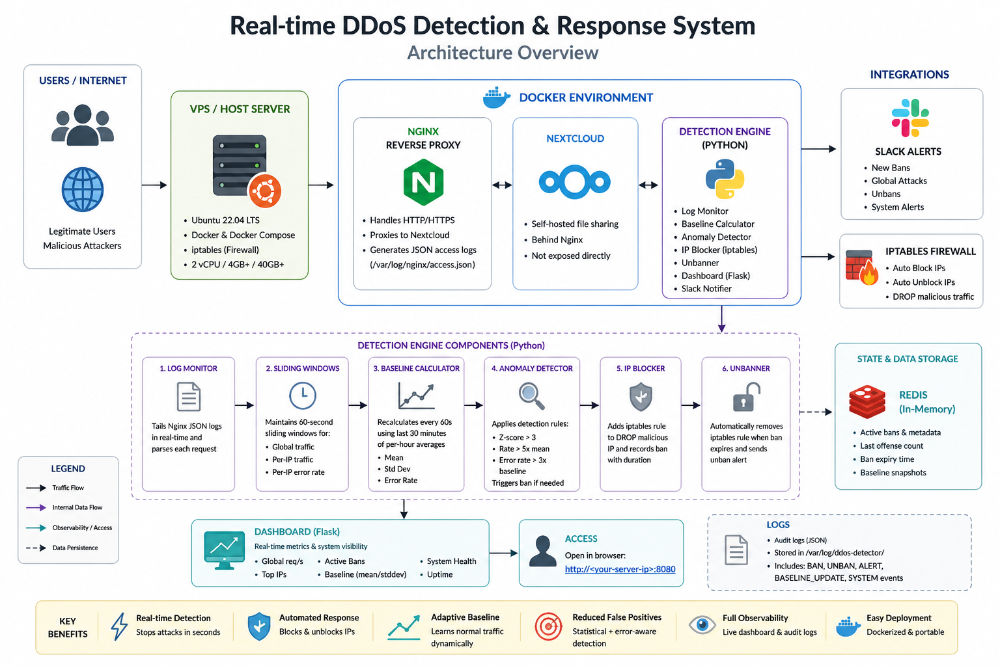

**HNG DevSecOps Anomaly Detection Engine**

**Overview**
This project is a real-time anomaly detection system built for HNG Cloud (cloud.ng) to monitor HTTP traffic flowing through a Nextcloud instance running behind Nginx. It detects abnormal traffic behavior, blocks malicious IPs automatically using iptables, and provides real-time visibility through a live dashboard and Slack alerts.

The system is fully containerized and designed to run continuously on a Linux VPS.

**System Architecture**

**Live System Information**
- Server IP: <YOUR_SERVER_IP>
- Dashboard URL: http://<YOUR_SERVER_IP>:8080
- Nextcloud URL: http://<YOUR_SERVER_IP>

**Why This Project Matters**
Modern cloud applications are constantly exposed to:
- brute-force login attempts
- bot traffic spikes
- DDoS-style request floods

Instead of relying on static rules, this system learns normal traffic behavior and reacts dynamically when anomalies occur.

**How It Works (High Level)**
1. Nginx receives all incoming HTTP requests
2. Logs are written in JSON format
3. Python daemon continuously tails logs in real time
4. Sliding window tracks last 60 seconds of traffic
5. Rolling baseline learns normal behavior over 30 minutes
6. Detector compares live traffic vs baseline
7. If anomaly is detected:
    - IP is blocked using iptables
    - Slack alert is sent
    - Event is logged
8. Dashboard displays real-time system state

**Sliding Window Design**
We use two deque-based sliding windows:

**Global Window**
Tracks all requests in the last 60 seconds:
    - Used to detect traffic surges

**Per-IP Window**
Tracks requests per IP in the last 60 seconds:
    - Used to detect malicious actors
Old entries are automatically removed every second to maintain a rolling window.

**Baseline System (Learning Normal Traffic)**

The system maintains a rolling 30-minute history of request counts.
Every 60 seconds:
    - Mean traffic is recalculated
    - Standard deviation is updated
    - Hour-based grouping is used for accuracy

This ensures the system adapts to:
    - day vs night traffic
    - low vs peak usage periods

**Anomaly Detection Logic**
An IP or system is flagged if:
    - Z-score > 3.0 OR
    - Traffic > 5x baseline mean OR
    - Error rate > 3x baseline error rate

**Blocking Mechanism (iptables)**
When an anomaly is confirmed:
    iptables -I INPUT -s <IP> -j DROP
This immediately blocks traffic at the kernel level.

**Auto-Unban Policy**
    - 1st offense: 10 minutes
    - 2nd offense: 30 minutes
    - 3rd offense: 2 hours
    - 4th offense: permanent block

**Slack Alerts**
All events are reported in real time:
    - IP bans
    - IP unbans
    - global traffic spikes
Alerts include:
    - IP address
    - reason
    - current rate
    - baseline comparison

**Dashboard Features**
Accessible at port 8080:
    - CPU usage
    - Memory usage
    - system uptime
    - baseline mean/stddev
    - top 10 IPs
    - active bans
Auto-refreshes every 3 seconds.

**Tech Stack**
    - Python (core engine)
    - Flask (dashboard)
    - Nginx (reverse proxy)
    - Docker (deployment)
    - iptables (blocking)
    - Slack Webhooks (alerts)

**Setup Instructions (Fresh VPS)**
    git clone https://github.com/Fresh-Instinct/hng-anomaly-detector
    cd project
    docker-compose up -d --build
Then access:
    - Dashboard: http://SERVER_IP:8080
    - Nextcloud: http://SERVER_IP

**Key Design Decisions**
    - No external rate limiting libraries used
    - No Fail2Ban (strict requirement)
    - Custom sliding window implementation using deque
    - Real-time streaming log processing

**Author**
Fresh-Instinct

